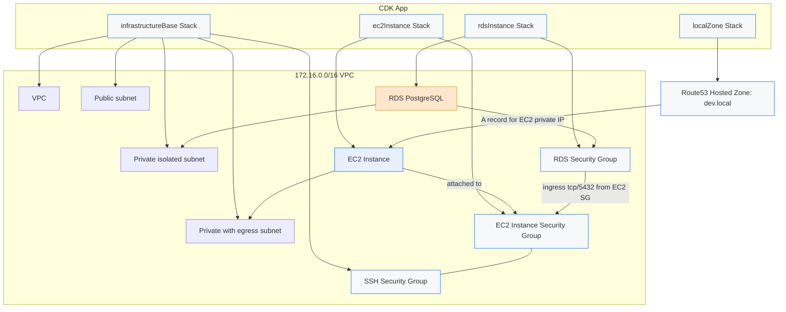

# CDK Codebase Architecture Map

## Overview
This repository defines a small AWS CDK application with three primary infrastructure stacks:

- `infrastructureBase` (`lib/infra-stack.ts`): creates the VPC, subnet tiers, SSH security group, and SSH key pair.
- `localZone` (`lib/route53-local-stack.ts`): creates a private Route53 hosted zone attached to the VPC.
- `ec2Instance` (`lib/ec2-stack.ts`): creates an EC2 instance inside a private subnet, assigns it a security group, and registers an internal DNS A record.
- `rdsInstance` (`lib/rds-stack.ts`): creates a PostgreSQL RDS instance in isolated subnets with secrets-managed credentials and security group rules.

The CDK app entrypoint is `bin/cdk-test.ts`.

## Mermaid Architecture Diagram

## Resource Map

### VPC and networking
- `lib/infra-stack.ts` defines the VPC with:
  - Public subnet
  - Private subnet with egress
  - Private isolated subnet
- The VPC CIDR is `172.16.0.0/16` with subnet masks defined by `cidrMask`.
- A shared SSH security group allows inbound SSH from anywhere (`0.0.0.0/0`) on TCP 22.
- A key pair is created using `ec2.CfnKeyPair` with the environment-specific key name.

### EC2 instance
- `lib/ec2-stack.ts` creates:
  - An EC2 instance in the private subnet tier (`PRIVATE_WITH_EGRESS`).
  - A dedicated security group for the instance.
  - An inbound rule that attaches the shared SSH security group to the instance for SSH access.
  - A Route53 A record in the private hosted zone that maps `dev-worker.dev.local` to the EC2 instance private IP.

### RDS database
- `lib/rds-stack.ts` creates a PostgreSQL `DatabaseInstance` with:
  - Credentials stored in AWS Secrets Manager.
  - A dedicated database security group.
  - Inbound port 5432 open from the EC2 instance security group.
  - A DB subnet group targeting the isolated subnets.
  - `publiclyAccessible: false` and encrypted storage.
  - Removal policy `DESTROY` for easy cleanup in dev.

### Route53
- `lib/route53-local-stack.ts` creates a private hosted zone for `${environment}.local` and associates it with the VPC.
- `lib/ec2-stack.ts` adds an `ARecord` inside this hosted zone.

## File Purpose and Dependencies

- `bin/cdk-test.ts`
  - Entrypoint for CDK deployment.
  - Instantiates `infrastructureBase`, `localZone`, `ec2Instance`, and `rdsInstance`.
  - Passes the VPC object and security groups between stacks.

- `lib/infra-stack.ts`
  - Core networking stack.
  - Exports VPC and shared SSH security group.

- `lib/route53-local-stack.ts`
  - Creates a VPC-associated private hosted zone.

- `lib/ec2-stack.ts`
  - Builds the compute node and private DNS record.
  - Depends on VPC, hosted zone, and SSH SG.

- `lib/rds-stack.ts`
  - Builds the database instance.
  - Depends on VPC, isolated subnet IDs, and EC2 SG ingress.

## Data Flow and Relationships

1. `bin/cdk-test.ts` provisions the base VPC and shared SSH SG.
2. The private hosted zone is created and attached to the VPC.
3. EC2 instance is launched in the private subnet using the VPC and EC2 security group.
4. The EC2 instance receives a Route53 A record in the private hosted zone.
5. The RDS instance is launched in isolated subnets and secured by its own DB security group.
6. Database access is allowed only from the EC2 instance security group on port 5432.

## Navigation Guide

- Start with `bin/cdk-test.ts` to see how stacks are composed.
- Review `lib/infra-stack.ts` to understand VPC/subnet and shared SSH access.
- Review `lib/route53-local-stack.ts` for DNS zone attachment to the VPC.
- Review `lib/ec2-stack.ts` for EC2 placement, security group configuration, and internal DNS.
- Review `lib/rds-stack.ts` for PostgreSQL database creation, secret management, and subnet isolation.

## Notes

- The current app creates a development environment by default (`dev`).
- The RDS instance is non-public and only accessible from the EC2 instance security group.
- The private hosted zone is internal only, not exposed to the public internet.
