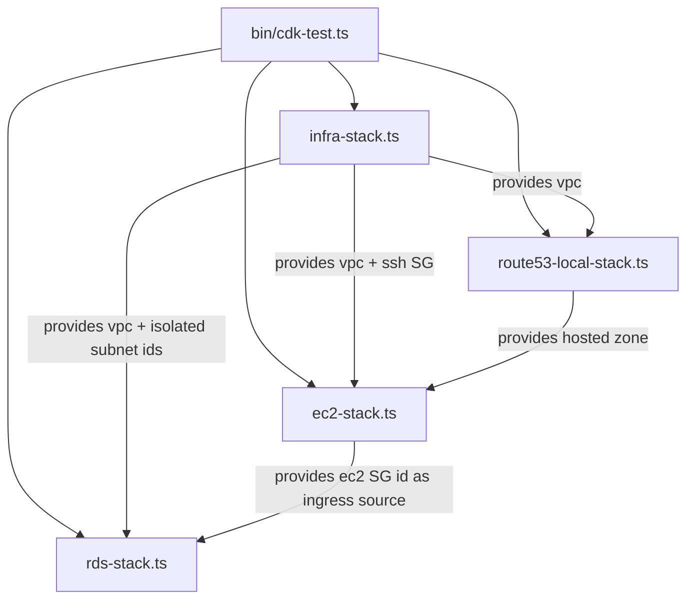

# CDK Codebase Architecture Map

## Purpose
This document maps the CDK architecture in this repository, including stack composition, AWS resources, dependency flow, and where to navigate in code.

## Stack Composition
- `infrastructureBase` in `lib/infra-stack.ts`
  - Creates VPC, subnet tiers, shared SSH security group, and a key pair.
- `localZone` in `lib/route53-local-stack.ts`
  - Creates a private Route53 hosted zone (`${environment}.local`) attached to the VPC.
- `ec2Instance` in `lib/ec2-stack.ts`
  - Creates an EC2 instance, instance security group, and private Route53 A record.
- `rdsInstance` in `lib/rds-stack.ts`
  - Creates PostgreSQL RDS, DB security group, DB subnet group, credentials secret, and outputs.

Entry point: `bin/cdk-test.ts`.

## Architecture Diagram (Resources + Relationships)

```mermaid
flowchart LR
  subgraph APP[CDK App - bin/cdk-test.ts]
    ST_INF[infrastructureBase]
    ST_DNS[localZone]
    ST_EC2[ec2Instance]
    ST_RDS[rdsInstance]
  end

  subgraph NET[VPC 172.16.0.0/16]
    VPC[VPC]
    SN_PUB[Public Subnets]
    SN_PRIV[Private With Egress Subnets]
    SN_ISO[Private Isolated Subnets]
  end

  SG_SSH[SSHSecurityGroup
  ingress: tcp/22 from 0.0.0.0/0]
  KEY[MainKeyPair
  id-main-key]

  HZ[Private Hosted Zone
  ${environment}.local]
  AREC[ARecord
  ${id}.${environment}.local]

  SG_EC2[ec2InstanceSecurityGroup]
  EC2[EC2 Instance
  Amazon Linux 2, t2.micro]

  SG_DB[DatabaseSecurityGroup
  self all + 5432 from EC2 SG]
  SUBGRP[DatabaseSubnetGroup
  isolated subnets]
  SECRET[Secrets Manager Secret
  db credentials]
  PARAM[Postgres ParameterGroup]
  RDS[RDS PostgreSQL
  non-public, encrypted]

  ST_INF --> VPC
  ST_INF --> SG_SSH
  ST_INF --> KEY
  VPC --> SN_PUB
  VPC --> SN_PRIV
  VPC --> SN_ISO

  ST_DNS --> HZ
  HZ --> VPC

  ST_EC2 --> SG_EC2
  ST_EC2 --> EC2
  ST_EC2 --> AREC
  EC2 --> SN_PRIV
  EC2 --> SG_EC2
  EC2 --> SG_SSH
  AREC --> HZ
  AREC --> EC2

  ST_RDS --> SG_DB
  ST_RDS --> SUBGRP
  ST_RDS --> SECRET
  ST_RDS --> PARAM
  ST_RDS --> RDS
  SUBGRP --> SN_ISO
  RDS --> SG_DB
  RDS --> SUBGRP
  RDS --> SECRET
  RDS --> PARAM
  SG_DB --> SG_EC2
```

## Stack Dependency Graph

```mermaid
flowchart TD
  A[bin/cdk-test.ts]
  B[infra-stack.ts]
  C[route53-local-stack.ts]
  D[ec2-stack.ts]
  E[rds-stack.ts]

  A --> B
  A --> C
  A --> D
  A --> E

  B -- provides vpc --> C
  B -- provides vpc + ssh SG --> D
  C -- provides hosted zone --> D
  B -- provides vpc + isolated subnet ids --> E
  D -- provides ec2 SG id as ingress source --> E
```

## Resource Inventory

### Networking and Compute
- VPC with three subnet classes:
  - `PUBLIC`
  - `PRIVATE_WITH_EGRESS`
  - `PRIVATE_ISOLATED`
- Shared SSH security group with inbound SSH (`tcp/22`) from any IPv4 source.
- EC2 instance placed in `PRIVATE_WITH_EGRESS` subnet selection.
- EC2 instance uses a dedicated security group plus shared SSH group attachment.

### DNS
- Route53 private hosted zone for `${environment}.local`, VPC-associated.
- Route53 A record mapping EC2 private IP to `${id}.${environment}.local`.

### Database
- PostgreSQL RDS `DatabaseInstance`.
- DB security group rules:
  - self-ingress all traffic
  - ingress `tcp/5432` from EC2 security group source(s)
  - all outbound allowed
- DB subnet group built from isolated subnets.
- Secrets Manager secret for DB credentials.
- Parameter group for PostgreSQL engine version.
- Single-user secret rotation enabled.

### Outputs
- EC2 stack output: `ec2ServersSG`.
- RDS stack outputs: `dbEndpoint`, `dbUserName`, `dbDbName`.

## Data Flows
1. App bootstraps stack instances in `bin/cdk-test.ts` and wires outputs as props.
2. Infrastructure stack creates VPC + shared SSH SG first; these are reused by later stacks.
3. DNS stack creates a private hosted zone bound to the shared VPC.
4. EC2 stack launches worker instance in private-with-egress subnet and registers private DNS A record.
5. RDS stack creates PostgreSQL in isolated subnets and restricts client access to EC2 SG ingress on 5432.
6. Application-level DB connection path is expected to be: EC2 -> Route53/private networking -> RDS endpoint.

## File Purpose Map

### Entrypoint
- `bin/cdk-test.ts`
  - Builds all stacks.
  - Resolves environment, account, region, SSH key name.
  - Passes cross-stack objects and identifiers.

### Stack Implementations
- `lib/infra-stack.ts`
  - Core network baseline and shared access controls.
- `lib/route53-local-stack.ts`
  - Internal DNS zone.
- `lib/ec2-stack.ts`
  - Worker compute + instance SG + A record.
- `lib/rds-stack.ts`
  - DB networking, credentials, engine params, and instance.

### Supporting
- `README.md`
  - Project usage notes.
- `cdk.json` and `cdk.context.json`
  - CDK runtime configuration/context.
- `test/`
  - Jest scaffolding for CDK tests.

## Navigation Guide
1. Start in `bin/cdk-test.ts` to understand orchestration and dependency passing.
2. Open `lib/infra-stack.ts` to inspect subnet and baseline security design.
3. Open `lib/route53-local-stack.ts` to review private DNS scope.
4. Open `lib/ec2-stack.ts` to trace compute placement, SG assignment, and DNS record naming.
5. Open `lib/rds-stack.ts` to verify DB subnet isolation, secret generation, and ingress rules.

## Operational Notes
- Default environment is `dev` when `ENV` is not provided.
- RDS is explicitly non-public (`publiclyAccessible: false`).
- RDS uses `RemovalPolicy.DESTROY`, suitable for non-production workflows.
- SSH access is internet-open by rule; if this repo evolves toward production, restrict source ranges.
